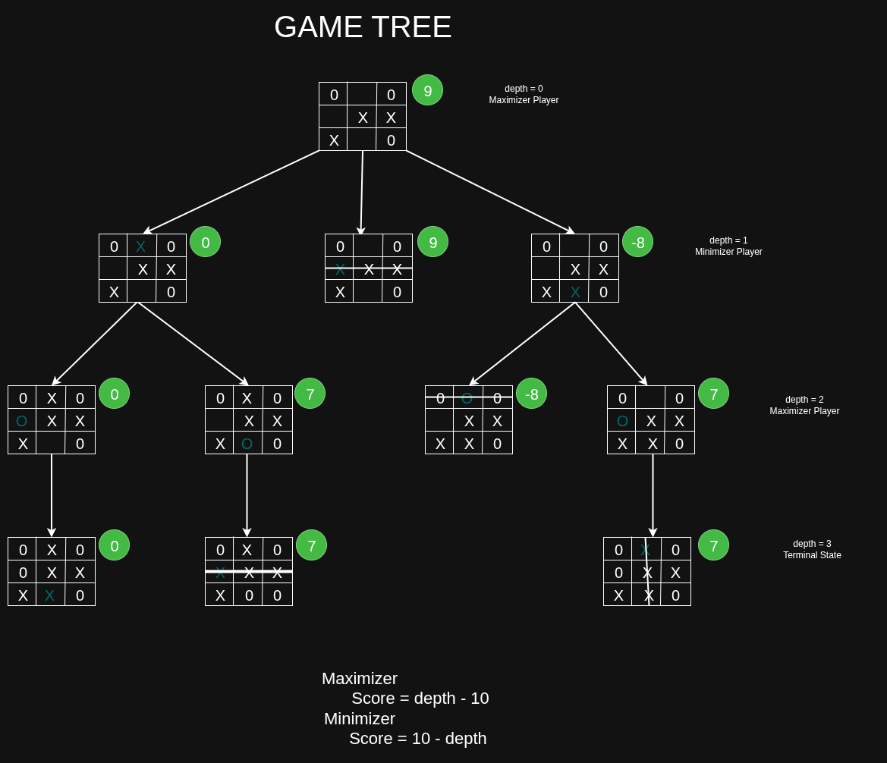

# Minimax Algorithm – AI for Tic-Tac-Toe

The Minimax algorithm is a decision-making algorithm used in Artificial Intelligence for turn-based, two-player games.

It is commonly used in games like:
- Tic-Tac-Toe
- Chess
- Chinese Go

## 🎯 Core Idea

Minimax assumes:
- Both players play optimally
- One player tries to maximize the score
- The other player tries to minimize the score

`Maximizer Player:` It wants to maximize the score assuming opponent would play best possible move.

`Minimizer Player:` It wants to minimize the score assuming opponent would play best possible move.

## 🌳 Game Tree Representation

- Minimax works by building a game tree:
- Each node represents a board state.
- Each edge represents a valid move.
- Levels alternate between Maximizer and Minimizer.
- The tree expands until a terminal state is reached.

### A terminal state can be:
- AI wins
- Human wins
- Draw (Tie)

## 🔁 How the Algorithm Works

1. Generate all possible valid moves.
2. Recursively simulate each move.
3. Switch turns between maximizer and minimizer.
4. Continue until reaching a terminal state.
5. Assign a score based on the result.
6. Backtrack and propagate scores upward:
7. If it is the Maximizer's turn, choose the maximum score among children.
8. If it is the Minimizer's turn, choose the minimum score among children.
9. The root node finally contains the best optimal move score.
10. The AI selects the move corresponding to that score.

## Why It Works

Minimax explores `all possible game outcomes `assuming optimal play from both players.
This guarantees the best possible move for the AI in Tic-Tac-Toe.

Since Tic-Tac-Toe has a small state space, full tree exploration is computationally feasible.

## ⏱ Time Complexity
Worst-case time complexity:

    O(b^d)

Where:

    b = branching factor (available moves)

    d = depth of game tree

For Tic-Tac-Toe, this is manageable.


## Psuedo code of minimax algorithm
```
def minimax(state, depth, is_maximizing):
    if is_game_over(state): 
        return evaluate(state)
    
    if is_maximizing == True: 
        best = -infinite

        for move in state: 
            make_move(move, state)
            score = minimax(state, depth+1, False)
            best = max(best, score)
            undo_move(state)
        
        return best 
    else: 
        best = +infinite

        for move in state: 
            make_move(move, state)
            score = minimax(state, depth+1, False)
            best = min(best, score)
            undo_move(state)
        
        return best 

```

`is_game_over(state)` would check win or tie state in the game

`evaluate(state)` Calculates the score for terminal state of game

## Pictorial Representation of Game Tree of Tic-Tac-Toe


`depth` parameter has been used to calculate score of terminal node, it ensure minimax algo chooses the move which requires less number of move.


## Resources 
[Minimax implementation by coding train YouTube Channel](https://youtu.be/trKjYdBASyQ?si=kjMoUpm6FOdAMiDB)

[Minimax with Alpha beta Pruning by Sabastian Langue](https://youtu.be/l-hh51ncgDI?si=LgiPRZsKuOaAYpoL)

[GFG Article](https://www.geeksforgeeks.org/artificial-intelligence/mini-max-algorithm-in-artificial-intelligence/)


## Optimization of Minimax algorithm with alpha beta Pruning

Minimax algorithm can be optimized and we can reduce computational time of algorithm by eliminating some branches of game tree with **alpha-beta pruning**.

We have to maintain two extra variable alpha and beta

`alpha`: Store the best score for maximizing player so far

`beta`: Stoe the best score for minizing player so far

Whenever, `alpha >= beta` we can eliminate the branch as it would not have any effect in the final outcome.


The pseudo code and game tree with alpha beta prunning will come sooooon

